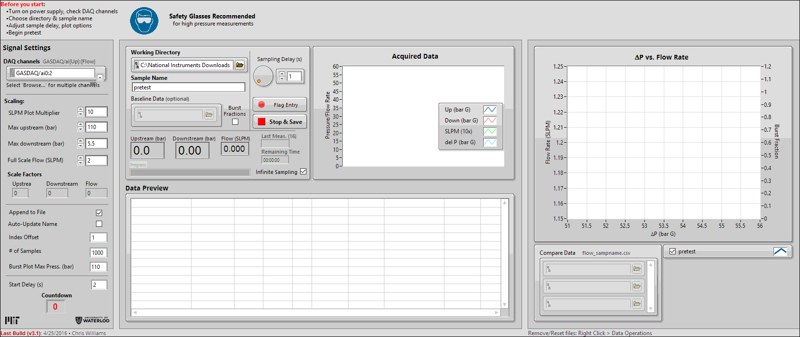

# auto-daq
LabVIEW interface for automated collection and processing of analog gas pressure/flow data

Virtual data acquisition (DAQ) instrument created during my time as a visiting student in the MIT Nano & Microfluidics lab that was used to facilitate the collection of critical data used in the publication of our work (manuscript currently under consideration).

Takes analog 0-5Vdc input from 3 sensors (2 pressure sensors and one mass-flow sensor, pictured above) and records/processes the data in real time.
Includes functionality allowing user to compare data to past measurements and a number of sampling/display options.

Block Diagram:

Interface:

## Dependencies
Created in LabVIEW 2015 and downgraded for use with LabVIEW 2013. VIs responsible for interfacing with the National Instruments DAQ require a compatible version of NI-DAQmx. Sub-VIs: POLY PLOT (readcsv.vi) and BURST FRAC (burst_frac.vi).
